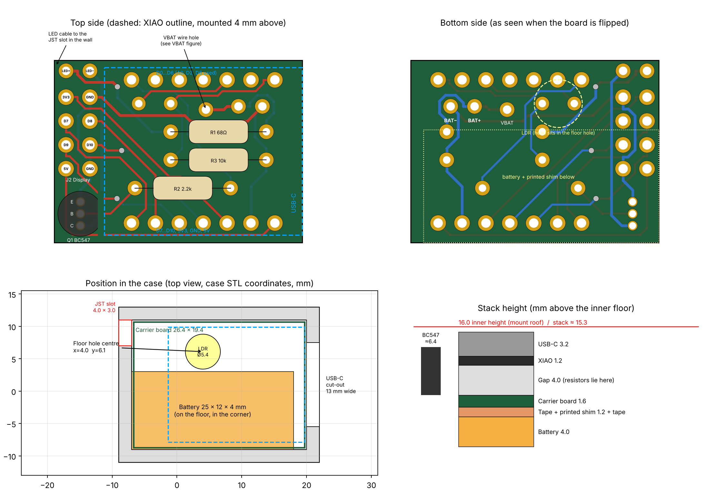
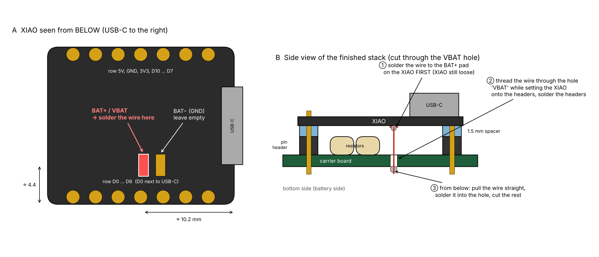
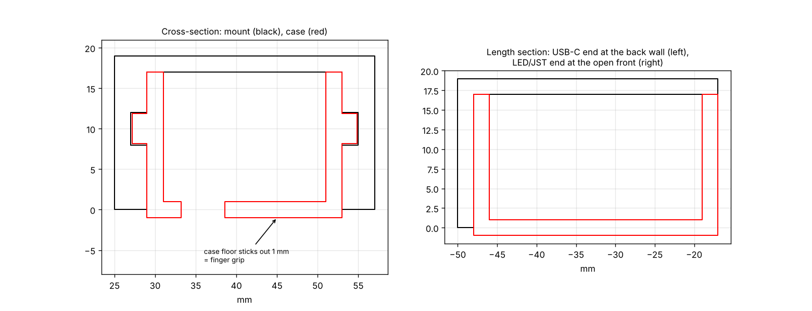

# UV-Sight Hardware

Carrier board and 3D-printed case for **UV-Sight**: automatic UV illumination, cant indicator and shot counter for a compound bow sight, built around a Seeed Studio XIAO nRF52840 Sense.



> **AI-generated design.** The board layout, schematic, case modifications and this guide were created with Claude (Anthropic) together with the project owner. The design has been checked with KiCad's design rule check and against the 3D models, but **it has not been built and tested on real hardware yet.** Build at your own risk. LiPo batteries can be dangerous if handled wrongly.

---

## What's in this folder

| Folder / file | What it is | Do you need it? |
|---|---|---|
| `gerber/uv-sight-carrier_gerber.zip` | Manufacturing files for the board | **Yes**: upload this zip to a PCB maker |
| `3d-print/case.stl` | Case, fits the bow mount | **Yes**: print it |
| `3d-print/shim.stl` | 1.2 mm spacer between battery and board | **Yes**: print it |
| `3d-print/header-spacer.stl` | 1.5 mm strip that lifts the XIAO on its pin header | **Yes**: print it **twice** |
| `3d-print/rail-test/` | Four short test pieces to find the right rail fit for your printer | Recommended |
| `docs/` | Assembly drawing, VBAT wire drawing, schematic (PDF), mount fit | Read while building |
| `kicad/` | KiCad project (schematic and board) | Only if you want to change the design |

---

## 1. Order the board

Upload `gerber/uv-sight-carrier_gerber.zip` to any PCB maker (JLCPCB, PCBWay, Aisler and others). Use these settings:

| Setting | Value |
|---|---|
| Layers | 2 |
| Size | 26.4 × 19.4 mm |
| Thickness | **1.6 mm** (the height of the case is calculated with 1.6 mm) |
| Surface finish | HASL lead-free or ENIG |
| Colour | any |

Minimum track width 0.3 mm, minimum clearance 0.2 mm and minimum drill 0.3 mm are standard at every maker.

## 2. Print the parts

**Material: PETG** (or ASA if your printer has an enclosure). Do not use PLA. It softens at about 55 °C, for example in a car in summer, and becomes brittle in the cold.

- Use an **opaque, dark** filament. Translucent plastic lets light through the walls onto the light sensor and spoils the light reading.
- Layer height 0.12–0.16 mm, at least 5 perimeters (the 2 mm walls come out solid).
- Print the case with the open side up.

**Rail fit:** the rails on the sides of the case slide into the bow mount. Printers differ, so first print the four pieces in `3d-print/rail-test/`, **in the same material as the case**. They have 0.10, 0.15, 0.20 and 0.25 mm less material on each face of the rail. The number of notches on top of one wall tells you which is which (1 notch = 0.10 mm, 4 notches = 0.25 mm). Pick the one that slides in with a little force. `case.stl` uses **0.15 mm**. If you need another value, the case has to be regenerated with that value.

## 3. Parts list

| Ref | Part | Qty | Notes |
|---|---|---|---|
| U1 | Seeed Studio XIAO nRF52840 **Sense** | 1 | |
| – | Pin header 1×7, 2.54 mm | 2 | connects the XIAO to the carrier board |
| – | `header-spacer.stl`, printed | 2 | lift the XIAO to 4 mm above the board so the resistors fit underneath |
| R1 | Resistor 68 Ω, 1/4 W | 1 | LED current |
| R2 | Resistor 2.2 kΩ, 1/4 W | 1 | transistor base |
| R3 | Resistor 10 kΩ, 1/4 W | 1 | light sensor divider |
| Q1 | BC547 (or BC337), TO-92 | 1 | |
| R4 | Photoresistor GL5528, 5 mm, leaded | 1 | |
| J1 | LiPo 3.7 V, 85 mAh, about 4 × 12 × 25 mm, **with protection circuit** | 1 | wires soldered to J1 |
| J3 | UV LED 5 mm, 390–405 nm, on a 2-wire cable | 1 | sits in the sight |
| – | Micro-JST 1.25 mm 2-pin plug + socket with wires (PicoBlade compatible, about 4 × 3 mm) | 1 pair | LED cable through the case wall |
| – | Thin insulated wire, e.g. 30 AWG wire-wrap wire | ~2 cm | **VBAT wire** (see step 6) |
| – | Double-sided tape without foam core, e.g. 3M 467MP | – | holds battery, shim and board |
| – | Pin header 2×4 or wires (optional) | 1 | display connector J2 |

## 4. Build the board

The order matters: the XIAO covers everything below it once it is soldered in.



1. **Resistors R1, R2, R3.** Insert them from the top, lying flat; the values are printed on the board. Solder them on the bottom and cut the leads short.
2. **Light sensor R4 (LDR).** Insert it **from the bottom**, so its head is on the battery side, and solder it on the top. **Keep the legs long**: the head has to reach down into the hole in the case floor, about 6 mm below the board. Bend it to height later in the case.
3. **Transistor Q1.** Insert it from the top, standing, **flat side facing the XIAO**. The collector goes into the square pad. Solder it on the bottom.
4. **Battery wires (J1).** Insert them from the bottom and solder them on the top. **BAT+ goes into the square pad.** The battery's third wire (temperature sensor) is not used: cut it short and insulate it.
5. **LED cable (J3).** Use the JST pigtail. Insert it from the top and solder it on the bottom. **LED+ (anode, long LED leg) goes into the square pad.** Leave some slack inside the case and tie a knot in the cable as strain relief.
6. **VBAT wire.** This is the only tricky step; see the drawing above.
   - **Why it is needed:** the XIAO takes battery power only from a small **BAT+** pad on its **underside**, not from a header pin. The LED also needs battery voltage, so a short wire brings BAT+ from that pad down to the carrier board, into the hole marked **VBAT**.
   - **a)** Turn the bare XIAO upside down. Find the two pads in the middle: **BAT+** is about 10 mm from the USB-C end and about 4.4 mm from the D0–D6 edge. Solder about 15 mm of thin insulated wire to it, pointing straight away from the board. Leave the BAT− pad next to it empty: it is ground and is already connected through the GND header pin.
   - **b)** Put both 1×7 pin headers into the carrier board, long pins up, and slide a printed `header-spacer` over the pins of each header, on top of the black plastic. Set the XIAO onto the pins with USB-C at the end **opposite** J2, and **thread the wire through the VBAT hole** as you do. Solder the XIAO to the pins on top, then the pins on the bottom.
   - **c)** From the bottom, pull the wire straight, solder it into the VBAT hole and cut off the rest.
7. **Bottom side.** Cut all lead ends as short as possible with flush cutters.
8. **Check before connecting anything:** with a multimeter, make sure there is **no short between BAT+ and BAT−** on J1, and that the VBAT hole is connected to BAT+.

## 5. Put it into the case

1. **Battery:** stick it flat onto the case floor with tape, in the corner away from the hole in the floor.
2. **Shim:** tape `shim.stl` onto the battery. The solder joints on the bottom of the board sit in the cut-outs of the shim. **Never let solder joints touch the LiPo**: a sharp lead can pierce the pouch and short the cell.
3. **Board:** tape the board onto the shim, USB-C towards the wide cut-out. Bend the LDR so that its head sits in the floor hole.
4. **JST connector:** press it into the slot at the top of the end wall opposite USB-C. The slot is made to the plug's measured size of 4.0 × 3.0 mm; file it if it is too tight. Fix it from inside with a little hot glue.

**Never solder on the board while the battery is attached underneath.**

The stack is about 15.3 mm high, and the case is 16 mm high inside.

## 6. Bow mount



The mount has a closed roof (it closes the open top of the case) and a closed back wall. Slide the case in **USB-C end first**, so that the **LED/JST end faces the open front**. The case floor sticks out of the mount by 1 mm, so you can grip it with your fingers to pull the case out, for example for charging.

The rails are at the same height as in the original case, so the case fits the existing mount.

---

## Reference

### Wiring

The wiring is the same as in the UV-Sight firmware README (firmware 5.8):

| Function | XIAO pin |
|---|---|
| UV LED, PWM through Q1 | D6 |
| LDR supply (HIGH only while measuring) | D2 |
| LDR measurement | A0 / D0 |
| Battery | BAT+ pad (via the VBAT wire), GND |

Full schematic: [docs/schematic.pdf](docs/schematic.pdf)

### J2: display / expansion connector

Eight holes behind the XIAO, directly below the LED pads. Pin 1 is the square pad.

```
 1  3V3          2  GND
 3  D7           4  D8  (SPI SCK)
 5  D9 (MISO)    6  D10 (SPI MOSI)
 7  5V           8  GND
```

- **SPI display:** fits directly. Use SCK = D8 and MOSI = D10; CS and DC on D7 and D9, for example.
- **I²C display:** the XIAO's default I²C pins D4 (SDA) and D5 (SCL) are on the other header row and are not on J2. Solder to the XIAO's header pins, or move I²C in the firmware.
- **5V** only exists while USB is plugged in. Power a display from 3V3.

### Opening the KiCad project

Open `kicad/uv-sight-carrier.kicad_pro` with KiCad 7 or newer. The project brings its own library for the XIAO footprint and the wire pads (`kicad/lib`); everything else comes from KiCad's standard libraries.
